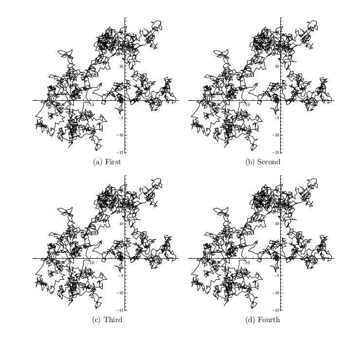

Python Document Scripting
=========================

This project provides a general Document Scripting framework, which is like JavaScript to HTML to create dynamic websites.

	Usage: ./pbs randwalk.tex
	
How to write scripts
--------------------

* document scripts should be written as comments
* we are using Python as the scripting language.
* write scripts inside blocks denoted by, '%' is comment marker for LaTeX
		%scriptstart:python
		%scriptend	
* in between can be any python code. use _RV to denote return value (inserted
text to the document.
		_RV = []	
so inside the script block, just use
		_RV.append(string)


LaTeX Examples
--------------

**Note** that you can set options before insert figures or tables

Avaiable options are: 

* floatopt = 'ht'
* centering = True
* label = None
* caption = None
* subcaptions = None
* numfloatperrow = ceil(sqrt(input_size))
* width = (0.9/numfloatsperrow)\\linewidth

    
    
### Insert an Image

Input:

```latex
%_RV.append(insertgraph('res/rw2d.pdf'))
```

Output:

```latex
\begin{figure}[ht]
\begin{centering}
\includegraphics[width=0.90\linewidth]{res/rw2d.pdf}
\end{centering}
\end{figure}
```

### Insert Images with SubCaptions and Each Row align 2 Images



Input:

```latex
%subcaptions=["First", "Second", "Third", "Fourth"]
%_RV.append(insertgraphics(['res/rw2d.pdf', 'res/rw2d.pdf', 'res/rw2d.pdf', 'res/rw2d.pdf']))
```

Output:

```latex
\begin{figure}[ht]
\begin{centering}
\subfloat[First]{\begin{centering}
\includegraphics[width=0.45\linewidth]{res/rw2d.pdf}
\end{centering}
} \subfloat[Second]{\begin{centering}
\includegraphics[width=0.45\linewidth]{res/rw2d.pdf}
\end{centering}
}

\subfloat[Third]{\begin{centering}
\includegraphics[width=0.45\linewidth]{res/rw2d.pdf}
\end{centering}
} \subfloat[Fourth]{\begin{centering}
\includegraphics[width=0.45\linewidth]{res/rw2d.pdf}
\end{centering}
}

\end{centering}
\end{figure}
```

### Insert a table from a txt file


Input:

```latex
%_RV.append(inserttable('res/numres.txt'))
```

Output:

```latex
\begin{table}[ht]
\begin{center}
\begin{tabular}{ccccccc}
\hline
$\lambda$ & $\tau$ & $D$ & $D_{mean}$ & $E$ & $D_{var}$ & $E$ \\
\hline
1 & 1 & 0.25 & 0.2493 & 0.0028 & 0.2406 & 0.0377 \\
0.5 & 0.5 & 0.125 & 0.1234 & 0.0131 & 0.131 & 0.0482 \\
0.5 & 0.5 & 0.125 & 0.1246 & 0.0035 & 0.1203 & 0.038 \\
0.2 & 0.003 & 3.3333 & 3.2938 & 0.0119 & 3.3429 & 0.0029 \\
\hline
\end{tabular}
\end{center}
\end{table}
```